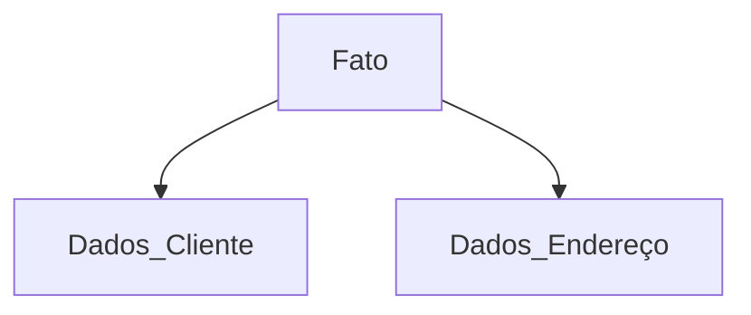

# Modelagem e implementação do banco de dados

### Projeto banco de dados desenvolvido para empresa que aloca e produz reboques para veículos.

A empresa desejou ter um controle maior dos clientes e também das datas e horários das alocações de seus reboques.

Quando um determinado reboque da empresa recebia uma notificação de infração, ocasionada por algum cliente, a empresa perdia muito tempo conferindo documentos feitos à mão na tentativa de descobrir qual, entre vários de seus clientes, possivelmente, estaria em posse do reboque, no intervalo de dia e hora da autuação.

Por meio da implementação do banco de dados, a empresa faz uma simples consulta para obter às informações desejadas.

### 🔎 Informações existentes em cada tabela:

+ **Dados-Cliente** 🙎‍♂️

Informações pessoais do cliente: Nome, registro geral, cpf, numero habilitação.

+ **Dados-Endereço** 🏡

Informações sobre o endereço do cliente: Rua, bairro, cidade, estado.

+ **Fato** 🕘

Informações relativas ao aluguel do reboque: Data e hora da alocação, data e hora da entrega, reboque utilizado.

