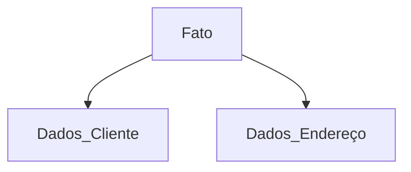

# Modelagem-Empresa

### Projeto banco de dados - Desenvolvido para uma empresa que trabalha com fabricação e alocação de reboques para veículos.
A necessidade de implementação de um banco de dados, surgiu do interesse da empresa
em fazer o controle de dados, como, datas e horários das alocações. 
Quando um reboque da empresa recebia uma infração, ocasionada por um
cliente, a empresa perdia muito tempo conferindo documentos feitos à mão, com a finalidade de descobrir qual, entre vários de seus clientes, possivelmente, estaria em posse do reboque, no intervalo de dia e hora da autuação. Com a implementação do banco de dados, a empresa simplesmente consulta as informações desejadas no sistema. 

+ A implementação do projeto foi feita utilizando banco de dados **Mysql**.

### 🔎 Informações existentes em cada tabela:

+ **Dados-Cliente** 🙎‍♂️

Informações pessoais do cliente: Nome, registro geral, cpf, numero habilitação.

+ **Dados-Endereço** 🏡

Informações sobre o endereço do cliente: Rua, bairro, cidade, estado.

+ **Fato** 🕘

Informações relativas ao aluguel do reboque: Data e hora da alocação, data e hora da entrega, reboque utilizado.

